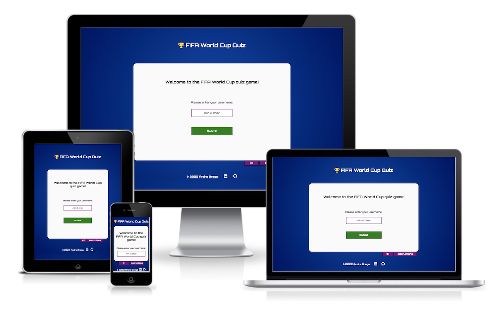
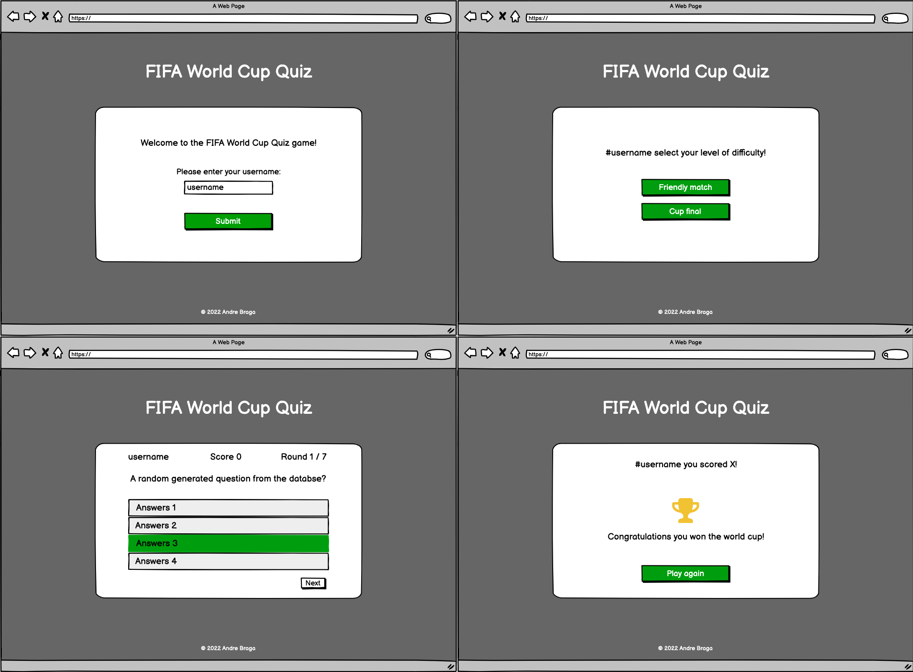
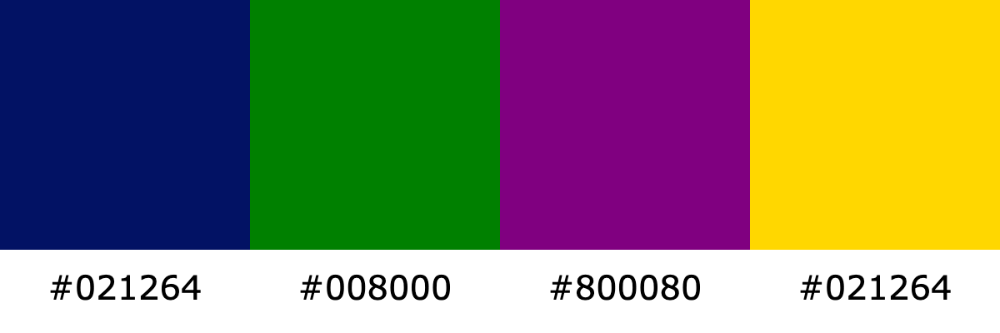
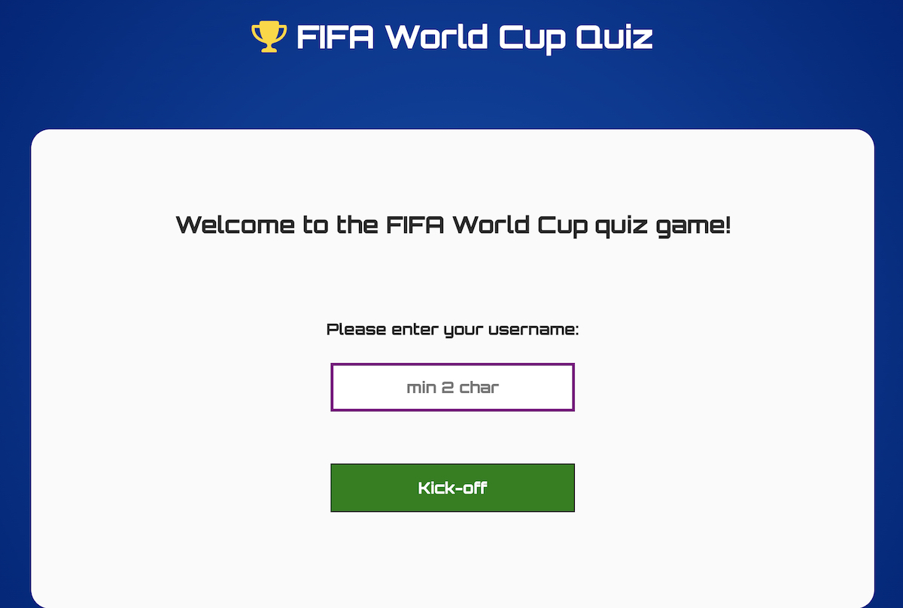
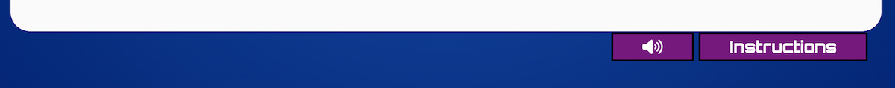
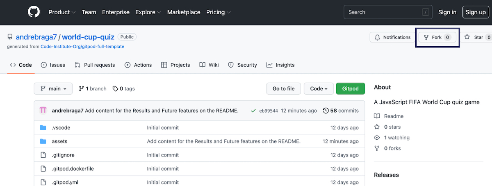
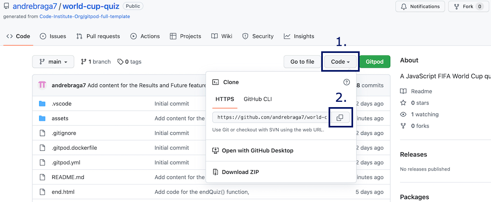

# Akemi Renewable Energies

FIFA World Cup Quiz Game, is a fun quiz game about fact of the FIFA World Cup tournaments. It challanges the user by asking different types of questions of every tournament in history. At the same time, the user can learn new unknown facts about the tournaments history and the legendary player throughout the years.

### Project objectives

1. Create a quiz game that will challenge the user in different levels of knowledge about the tournament;
2. Teach the user new fact about the FIFA World Cup;

You can follow the project along by visiting the [FIFA World Cup Quiz Game here](https://andrebraga7.github.io/world-cup-quiz)

# Table of content

- [**User Experience UX**](#user-experience-ux)
    - [User stories](#user-stories)
    - [Wireframes](#wireframes)
    - [Quiz structure](#quiz-structure)
    - [Design choices](#design-choices)
        - [*Typography*](#typography)
        - [*Colour scheme*](#colour-scheme)
- [**Features**](#features)
    - [Landing]()
        - [*Quiz area*]()
        - [*Controls*]()
        - [*Footer*](#footer)
    - [Level selection]()
        - [*Level options*]()
    - [Quiz rounds]()
        - [*Game info*]()
        - [*Question and answers*]()
    - [Results]()
        - [*Score and feedback*]()
        - [*Options*]()
    - [Future features](#future-features)
- [**Technologies Used**](#technologies-used)
- [**Testing**](#testing)
- [**Deployment**](#deployment)
    - [To deploy the website](#to-deploy-the-website)
    - [To fork the repository on GitHub](#to-fork-the-repository-on-github)
    - [To create a local clone of the project](#to-create-a-local-clone-of-the-project)
- [**Credits**](#credits)
    - [Content](#content)
    - [Media](#media)
- [**Acknowledgements**](#acknowledgements)

# User Experience (UX)

## User stories

- As a user I want to understand the purpose of the site straight away;
- As a user I want to have a personalized experience;
- As a user I want to be able to have control of any media playback;
- As a user I want to read any relevant instructions for the quiz;
- As a user I want to select different levels of difficulty;
- As a user I want to know how I'm progressing in the rounds;
- As a user I want to know if selected the correct answer and if not which one was the right one;
- As a user I want to see my score at the end of the quiz and have feedback on how I did;
- As a user I want to have options to play again, select a new level or leave the quiz.

[Back to table of content](#table-of-content)

## Wireframes

The wireframes for the quiz were created using [Balsamiq](https://balsamiq.com/). The mobile version of the quiz was created following the main full width wireframe and adding adjustments as needed to acomodate smaler screens.

[Back to table of content](#table-of-content)

## Quiz structure

The quiz is composed of four stages, **Landing**, **Level selection**, **Quiz rounds** and **Results**. The landing is the primary welcome page where the user is greated with a header and a title that gives a first impression of what the website is about with a username input field and a kick-off button to start. At the bottom there are two controls, on that turns the sound off and on and a second one that opens the quiz instructions. When the user clicks on kick-off, the username is captured and a new code is loaded so the user can select his desired level. When the user selects the level, the quiz shuffles the corresponding level questions and randomly selects 10 for the game. The game is made up of 10 rounds with each question having 4 possible answers but only one correct. When the user clicks on an answer the code check to see if it's correct and if so, the button background turns green and the score board imcrements by one point. If the answer is wrong, the background turns red. A solid green border is displayed on the left side of the correct answer. Only after selecting an answer the user can then proceed to the next round. This carries on until the user reaches the last round, the next round button changes to view score when the answers is selected. The view score section shows the user's score and displays a different message depending on the result. Lastly the user can choose to play again, select a new level or end the game, which reloads the page and goes back to the landing.

[Back to table of content](#table-of-content)

## Design choices

- ### Typography

    The font chosen for this project was [Orbitron](https://fonts.google.com/specimen/Orbitron). It has a fall back font of sans-serif. This font was chosen because it has a fun game like feel to it which helps with the user experience of playing a quiz game.

- ### Colour scheme
    The colour scheme is bright and fun, the blue resembles the FIFA logo, the green relates to the colour of the football pitch, the purple and gold integrate well with the other two to create a quiz game atmosphere.

    

[Back to table of content](#table-of-content)

# Features

The FIFA World Cup Quiz Game uses a simple user firendly interface designed to create a game like atmosphere encouraging the user to interact with all of the features and enjoy the quiz. The interface changes depending on the stage of the quiz. This is done by modifing the HTML code as the user progresses and interacts.

## Landing

- ### Quiz area
    Located at the very top of each page, it has a responsive deisign containing the company's logo which is clickable and links back to the home page. It also has navigation links to the other pages with a thick white border underlining the active page, which provides feedback to the user on what page he is currently on.

    

[Back to table of content](#table-of-content)

- ### Controls
    Bellow the menu comes the websites main hero image. It sets the mood straight away whilst also providing visual clues of what the site is about. On top of the image there is a first call to action text with a button, that invites the user to fill in his contact information in exchange of booking a free call with one of the companys specialist. The call to action button links to the contact form.

    

[Back to table of content](#table-of-content)

- ### Footer
    The our solutions sections, provides the user with information about what types of renewable energy the company works with and some of the benefits of each type. Information is displayed on top of a relevant background for each of the energy types, following the same design principle for the website. On smaller screens they sit on top of each other.

    

[Back to table of content](#table-of-content)

## Level selections

- ### Level options
    The cover image is represented by a commercial container building with solar panels on the roof which relates to what the company is about. It also has a title on top of the image that gives further explanation of the purpose of the about page.

    

[Back to table of content](#table-of-content)

## Quiz round

- ### Game info
    The contact cover image displays an engineer inspecting a solar panel in a solar farm. This gives further visual clues for the user of the support that can be expected. It also contains a title encouraging the user to contact the company.

    

[Back to table of content](#table-of-content)

- ### Question and answers
    - The form section provides the user with an option to contact the company by providing aditional information. The form has 5 text input fields: First name, Last name, Email, Phone number and the user message. All the fields have labels assigned.
    - At the bottom of the form there are the send and reset button.

    

[Back to table of content](#table-of-content)

## Future features

- A hamburguer menu for smaller screens;
- Create an image carousel on each project of the some of our projects section;
- Add a pop-up display confirmation for when the contact form is submited.

[Back to table of content](#table-of-content)

# Technologies Used

- [HTML5](https://html.spec.whatwg.org/multipage/) - provides the structure for the content of the website;
- [CSS3](https://www.w3.org/Style/CSS/Overview.en.html) - styles the content of the page;
- [JavaScript](https://www.javascript.com/) - adds functionality to the code;
- [Gitpod](https://www.gitpod.io/) - used to edit the website;
- [GitHub](https://github.com/) - used to host and deploy the website.

[Back to table of content](#table-of-content)

# Testing
Please refer to the [**TESTING**](TESTING.md) file for more information about the testing of FIFA World Cup Quiz Game.

[Back to table of content](#table-of-content)

# Deployment

## To deploy the website
The website was deplyoed to GitHub pages. You can fallow the steps below to deploy a webpage:

1. In the GitHub repository, click on the **Settings** tab;
2. Select the **Pages** option on the left hand side;
3. Under source, set the Branch to **main** and click on **Save**;
4. Once the changes are saved, a link to the live website will appear on the top of the page. It may take a few minutes until the website is published.

You can access the GitHub repository by clicking the following link: [https://github.com/andrebraga7/akemi](https://github.com/andrebraga7/akemi)

[Back to table of content](#table-of-content)

## To fork the repository on GitHub
You can create a copy of the repository by forking the GitHub account. This copy can be changed and edited without affecting the original repository. Follow the steps below to fork the repository:

1. Log in to the GitHub account and locate the [repositoty](https://github.com/andrebraga7/akemi);
2. On the top right hand side of the page, click the **Fork** button to create a copy of the original repository on your GitHub account.

[Back to table of content](#table-of-content)

## To create a local clone of the project
To create a clone of the project from GitHub, folow the steps below:

1. In the repository page, click on the **Code** tab;
2. On the **Clone HTTPS** section, click the copy button to copy the repository URL;

3. In your IDE of choice, open **Git Bash**;
4. Change the current working directory to the location where you want the cloned directory to be made;
5. Type **git clone** and then paste the URL copied from GitHub;
6. Press **enter** to create the local clone.

[Back to table of content](#table-of-content)

# Credits

## Content
- The **Orbitron** font used is from [**Google Fonts**](https://fonts.google.com/specimen/Orbitron) and was designed by [Matt McInerney](https://fonts.google.com/?query=Matt+McInerney);
- The icons used are from [**Font Awesome**](https://fontawesome.com/);
- [**Balsamiq**](https://balsamiq.com/wireframes/) was used to create the wireframes.
- The Fisher Yates method was used to randomly shuffle the questions and answers and an exemple of the code can be found [here](https://bost.ocks.org/mike/shuffle/);
- [**regex101**](https://regex101.com/) was used to create the regular expression that is used to check if the username provided by the user is valid.

## Media
- All the sound effects used came from royalty free stock from [**Pixabay**](https://pixabay.com/sound-effects/);
- The link for each individual  can be found as a comment in the code;

[Back to table of content](#table-of-content)

# Acknowledgements
This quiz game was creates as the second portfolio project for the Full Stack Software Developer course from [**Code Institute**](https://codeinstitute.net). I would like to thank my mentor, [**Precious Ijege**](https://www.linkedin.com/in/precious-ijege-908a00168/) for his guidance and support throught this project and the Code Institute team.

[**Andre Braga**](https://www.linkedin.com/in/andrestrevisan/) 2022

[Back to table of content](#table-of-content)