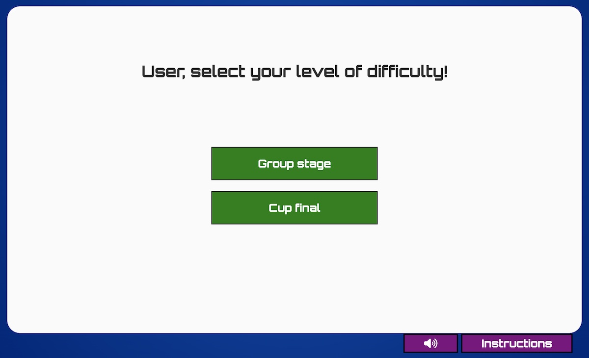
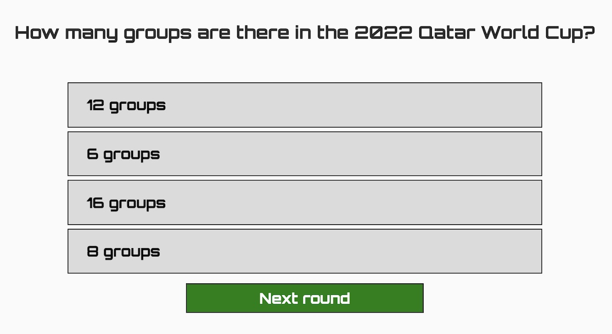
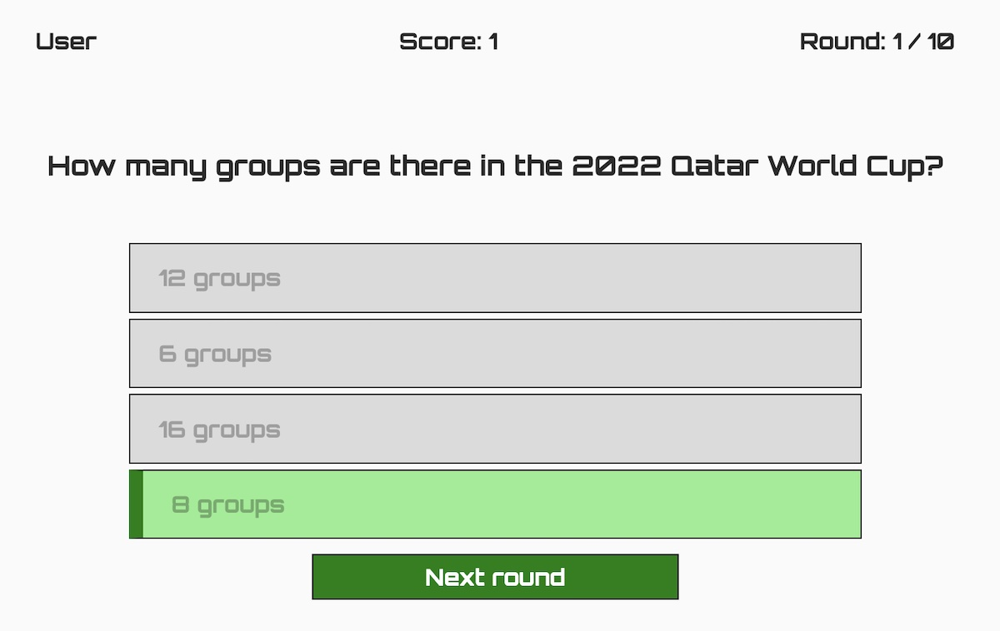
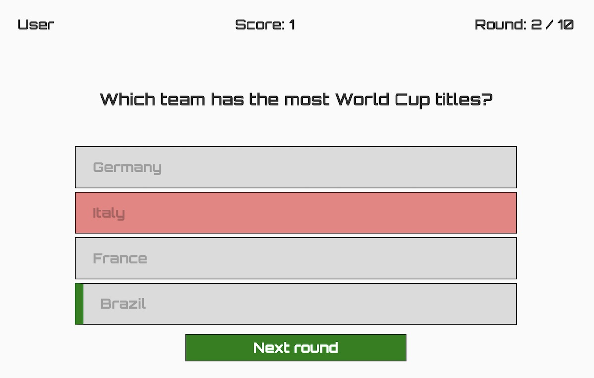
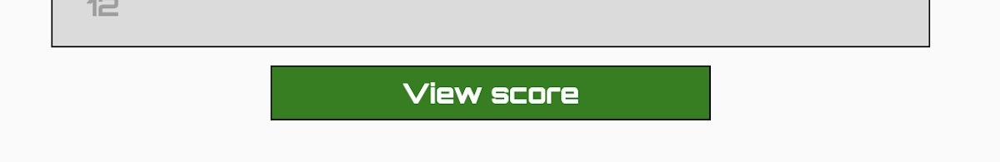
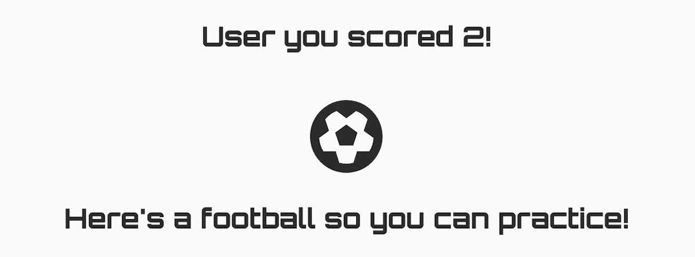
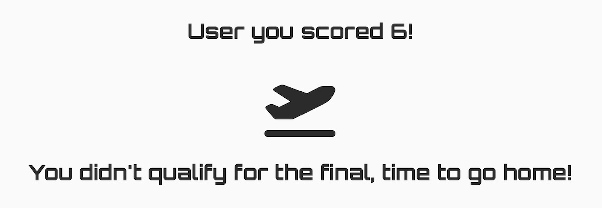
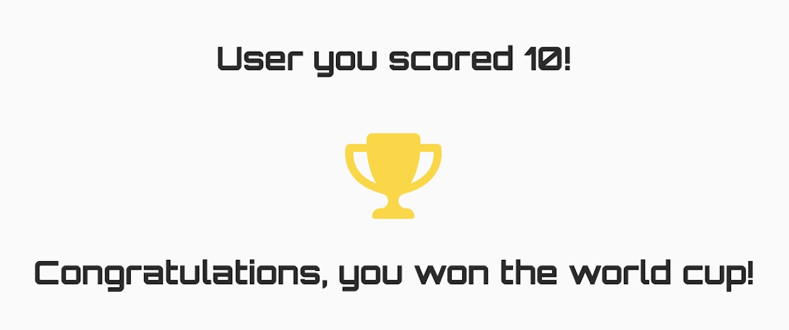
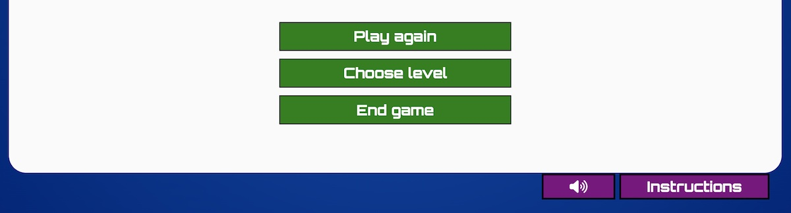
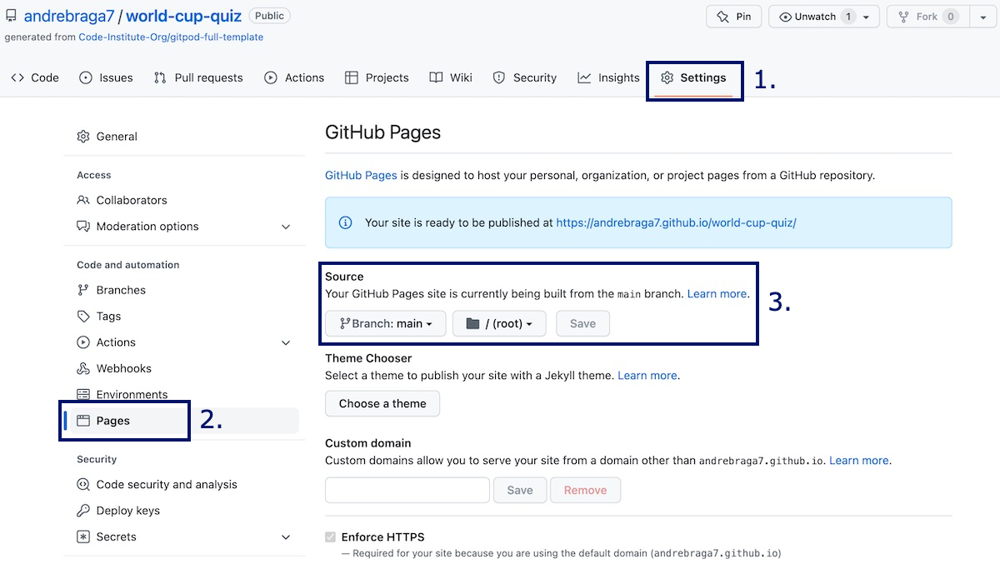

# FIFA World Cup Quiz Game

FIFA World Cup Quiz Game, is a fun quiz game about fact of the FIFA World Cup tournaments. It challanges the user by asking different types of questions of every tournament in history. At the same time, the user can learn new unknown facts about the tournaments history and the legendary player throughout the years.

### Project objectives

1. Create a quiz game that will challenge the user in different levels of knowledge about the tournament;
2. Teach the user new facts about the FIFA World Cup;

You can follow the project along by visiting the [FIFA World Cup Quiz Game here](https://andrebraga7.github.io/world-cup-quiz)

# Table of content

- [**User Experience UX**](#user-experience-ux)
    - [User stories](#user-stories)
    - [Wireframes](#wireframes)
    - [Quiz structure](#quiz-structure)
    - [Design choices](#design-choices)
        - [*Typography*](#typography)
        - [*Colour scheme*](#colour-scheme)
- [**Features**](#features)
    - [Landing](#landing)
        - [*Quiz area*](#quiz-area)
        - [*Controls*](#controls)
        - [*Footer*](#footer)
    - [Level selection](#level-selection)
        - [*Level options*](#level-options)
    - [Quiz rounds](#quiz-round)
        - [*Game info*](#game-info)
        - [*Question and answers*](#question-and-answers)
        - [*Correct answer*](#correct-answer)
        - [*Wrong answer*](#wrong-answer)
        - [*View score*](#view-score)
    - [Results](#results)
        - [*Score and feedback*](#score-and-feedback)
        - [*Options*](#options)
    - [Future features](#future-features)
- [**Technologies Used**](#technologies-used)
- [**Testing**](#testing)
- [**Deployment**](#deployment)
    - [To deploy the website](#to-deploy-the-website)
    - [To fork the repository on GitHub](#to-fork-the-repository-on-github)
    - [To create a local clone of the project](#to-create-a-local-clone-of-the-project)
- [**Credits**](#credits)
    - [Content](#content)
    - [Media](#media)
- [**Acknowledgements**](#acknowledgements)

# User Experience (UX)

## User stories

- As a user I want to understand the purpose of the site straight away;
- As a user I want to have a personalized experience;
- As a user I want to be able to have control of any media playback;
- As a user I want to read any relevant instructions for the quiz;
- As a user I want to select different levels of difficulty;
- As a user I want to know how I'm progressing in the rounds;
- As a user I want to know if selected the correct answer and if not which one was the right one;
- As a user I want to see my score at the end of the quiz and have feedback on how I did;
- As a user I want to have options to play again, select a new level or leave the quiz.

[Back to table of content](#table-of-content)

## Wireframes

The wireframes for the quiz were created using [Balsamiq](https://balsamiq.com/). The mobile version of the quiz was created following the main full width wireframe and adding adjustments as needed to acomodate smaler screens.

[Back to table of content](#table-of-content)

## Quiz structure

The quiz is composed of four stages, **Landing**, **Level selection**, **Quiz rounds** and **Results**. The landing is the primary welcome page where the user is greated with a header and a title that gives a first impression of what the website is about with a username input field and a kick-off button to start. At the bottom there are two controls, on that turns the sound off and on and a second one that opens the quiz instructions. When the user clicks on kick-off, the username is captured and a new code is loaded so the user can select his desired level. When the user selects the level, the quiz shuffles the corresponding level questions and randomly selects 10 for the game. The game is made up of 10 rounds with each question having 4 possible answers but only one correct. When the user clicks on an answer the code check to see if it's correct and if so, the button background turns green and the score board imcrements by one point. If the answer is wrong, the background turns red. A solid green border is displayed on the left side of the correct answer. Only after selecting an answer the user can then proceed to the next round. This carries on until the user reaches the last round, the next round button changes to view score when the answers is selected. The view score section shows the user's score and displays a different message depending on the result. Lastly the user can choose to play again, select a new level or end the game, which reloads the page and goes back to the landing.

[Back to table of content](#table-of-content)

## Design choices

- ### Typography

    The font chosen for this project was [Orbitron](https://fonts.google.com/specimen/Orbitron). It has a fall back font of sans-serif. This font was chosen because it has a fun game like feel to it which helps with the user experience of playing a quiz game.

- ### Colour scheme

    The colour scheme is bright and fun, the blue resembles the FIFA logo, the green relates to the colour of the football pitch, the purple and gold integrate well with the other two to create a quiz game atmosphere.

    

[Back to table of content](#table-of-content)

# Features

The FIFA World Cup Quiz Game uses a simple user firendly interface designed to create a game like atmosphere encouraging the user to interact with all of the features and enjoy the quiz. The interface changes depending on the stage of the quiz. This is done by modifing the HTML code as the user progresses and interacts.

## Landing

- ### Quiz area
    The very first page that the user sees. It has a header with the name of the quiz, a username input field with a label asking the user to enter his username and a "Kick-off" button, that submits and validades the username when clicked. The username has to be a minimum of 2 and a maximum of 15 alphanumeric characters including underline and at least one alphabet.

    

[Back to table of content](#table-of-content)

- ### Controls
    Bellow the quiz area there are two controls. The first one is a sound off and on toggle switch and the second button opens and closes the instructions when clicked. These controls remain visible throught the quiz.

    

[Back to table of content](#table-of-content)

- ### Footer
    At the very bottom of the page there is a simple footer with copyright information, a link to LinkedIn and GitHub. The design was thought to be very minimalistic not to distract the user from the main purpose which is the quiz.

    

[Back to table of content](#table-of-content)

## Level selection

- ### Level options
    The level selection is loaded when the user submits the username. It then display the username and asks the user to select a level to play the quiz. There are two levels: **Group stage** (the easier level) and **Cup final** (the harder level). The names of the levels come from the FIFA World Cup tournament, having the games in the group stage before advancing to the cup final. When the user click on a level, the code ramdomly shuffles the corresponding array of questions and selects the first 10. it then shuffles the answers order for each individual question out of the 10 selected. This makes it more interesting by not repeating the same questions in the same order with and having the answers display in a different order every time.

    

[Back to table of content](#table-of-content)

## Quiz round

- ### Game info
    The game info located on the top part of the quiz area shows the username, score and which round the quiz is on. The score is updated when the user clicks on the correct answer. The round is incremented by one when the user click on the Next round button.

    

[Back to table of content](#table-of-content)

- ### Question and answers
    - The question is displayed bellow the game info and above the answers. Everytime the user plays the quiz it randomly shuffles and selects 10 questions from the level array corresponding to the selected level by the user;
    - There are always four answers shown with only one being correct. Eveytime the user plays the quiz, it shuffles the order of the four answers.

    

[Back to table of content](#table-of-content)

- ### Correct answer
    When the user clicks on the correct answer the button's background turns green and a solid green left border is displayed inside the button. The score is then incremented by one and a sound effect for correct answer is played.

    

[Back to table of content](#table-of-content)

- ### Wrong answer
    If the user clikcs on a wrong answer, the button's background turns red and a solid green left border is displayed inside the correct answer button. The score is not incremented and a sound effect for wrong answer is played.

    

[Back to table of content](#table-of-content)

- ### View score
    When the user clicks on an answer on the last round (10), the Next round button changes to View score. This will take the user to the end of the quiz and display the final score.

    

[Back to table of content](#table-of-content)

## Results

- ### Score and feedback
    When the quiz ends, the user is presented with the total score and a message depending on the score result. If it's between 0 and 3 it displays a football icon and the text "Here's a football so you can practice!" and plays the sound effect for failure. If the result is between 4 and 7 it shows an airplane icon and the text "You didn't qualify for the final, time to go home!" and plays the sound effect for takeoff. If the score is between 8 and 10 it displays a trophy icon and the text "Congratulations, you won the world cup!" followed by the sound effect for success.

    Score between 0 and 3:
    

    Score between 4 and 7:
    

    Score between 8 and 10:
    

[Back to table of content](#table-of-content)

- ### Options
    Bellow the results message the user is given three options: **Play again** which will load the quiz again with the same level and randomly shuffled questions, **Choose level** which takes the user back to the level selection and **End game** which will reload the page taking the user back to the initial landing page where he submit a new username if desired.

    

[Back to table of content](#table-of-content)

## Future features

- Additional levels and questions making the quiz more complex;
- Integration with a data base to save the results and creation of a user ranking.

[Back to table of content](#table-of-content)

# Technologies Used

- [HTML5](https://html.spec.whatwg.org/multipage/) - provides the structure for the content of the website;
- [CSS3](https://www.w3.org/Style/CSS/Overview.en.html) - styles the content of the page;
- [JavaScript](https://www.javascript.com/) - adds functionality to the code;
- [Gitpod](https://www.gitpod.io/) - used to edit the website;
- [GitHub](https://github.com/) - used to host and deploy the website.

[Back to table of content](#table-of-content)

# Testing
Please refer to the [**TESTING**](TESTING.md) file for more information about the testing of FIFA World Cup Quiz Game.

[Back to table of content](#table-of-content)

# Deployment

## To deploy the website
The website was deplyoed to GitHub pages. You can fallow the steps below to deploy a webpage:

1. In the GitHub repository, click on the **Settings** tab;
2. Select the **Pages** option on the left hand side;
3. Under source, set the Branch to **main** and click on **Save**;
4. Once the changes are saved, a link to the live website will appear on the top of the page. It may take a few minutes until the website is published.

You can access the GitHub repository by clicking the following link: [https://github.com/andrebraga7/world-cup-quiz](https://github.com/andrebraga7/world-cup-quiz)

[Back to table of content](#table-of-content)

## To fork the repository on GitHub
You can create a copy of the repository by forking the GitHub account. This copy can be changed and edited without affecting the original repository. Follow the steps below to fork the repository:

1. Log in to the GitHub account and locate the [repositoty](https://github.com/andrebraga7/world-cup-quiz);
2. On the top right hand side of the page, click the **Fork** button to create a copy of the original repository on your GitHub account.

[Back to table of content](#table-of-content)

## To create a local clone of the project
To create a clone of the project from GitHub, folow the steps below:

1. In the repository page, click on the **Code** tab;
2. On the **Clone HTTPS** section, click the copy button to copy the repository URL;

3. In your IDE of choice, open **Git Bash**;
4. Change the current working directory to the location where you want the cloned directory to be made;
5. Type **git clone** and then paste the URL copied from GitHub;
6. Press **enter** to create the local clone.

[Back to table of content](#table-of-content)

# Credits

## Content
- The **Orbitron** font used is from [**Google Fonts**](https://fonts.google.com/specimen/Orbitron) and was designed by [Matt McInerney](https://fonts.google.com/?query=Matt+McInerney);
- The icons used are from [**Font Awesome**](https://fontawesome.com/);
- [**Balsamiq**](https://balsamiq.com/wireframes/) was used to create the wireframes.
- The Fisher Yates method was used to randomly shuffle the questions and answers and an exemple of the code can be found [here](https://bost.ocks.org/mike/shuffle/);
- [**regex101**](https://regex101.com/) was used to create the regular expression that is used to check if the username provided by the user is valid.

## Media
- All the sound effects used came from royalty free stock from [**Pixabay**](https://pixabay.com/sound-effects/);
- The link for each individual  can be found as a comment in the code;

[Back to table of content](#table-of-content)

# Acknowledgements
This quiz game was creates as the second portfolio project for the Full Stack Software Developer course from [**Code Institute**](https://codeinstitute.net). I would like to thank my mentor, [**Precious Ijege**](https://www.linkedin.com/in/precious-ijege-908a00168/) for his guidance and support throught this project and the Code Institute team.

[**Andre Braga**](https://www.linkedin.com/in/andrestrevisan/) 2022

[Back to table of content](#table-of-content)