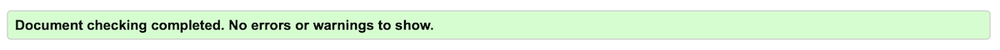
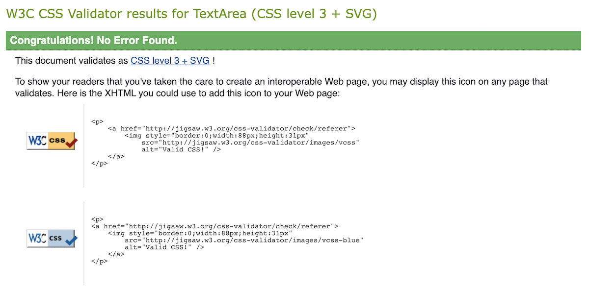
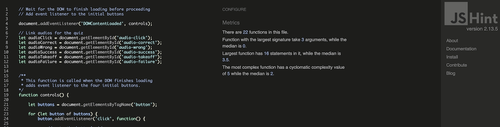
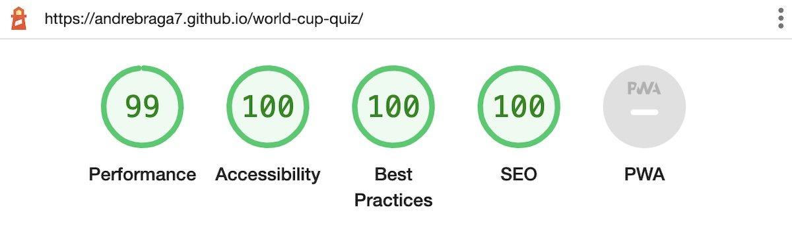

# Testing

## Code validation

The FIFA World Cup Quiz Game has been throughly tested and all the code has been run through the [W3C HTML validator](https://validator.w3.org/), the [W3C CSS validator](https://jigsaw.w3.org/css-validator/) and the [JSHint validator](https://jshint.com/). Minor errors were found by the JSHint validator because of some missing semicolon, this was easily fixed by adding them where needed.

Below are the HTML validator results for each of the stages:

- ### Landing

    

- ### Level selection

    

- ### Quiz round

    

- ### End quiz

    

Below are the CSS validator results:

Below are the JSHint validator results:

- There are 22 functions in this file;
- Function with the largest signature take 3 arguments, while the median is 0;
- Largest function has 16 statements in it, while the median is 3.5;
- The most complex function has a cyclomatic complexity value of 5 while the median is 2.

# Responsiveness test

The responsive design test was carried out manually through [**Google Chrome DevTools**](https://developer.chrome.com/docs/devtools/) and [**Responsive Design Checker**](https://responsivedesignchecker.com/).

|        | Soni Xperia Z2 | Samsung Galaxy S7 | Apple iPhone 7 | Apple iPad Mini | Apple iPad Pro| Display <1200px | Display >1200px |
|--------|:--------------:|:-----------------:|:--------------:|:---------------:|:-------------:|:----------------:|:----------------:|
| Render | pass           | pass              | pass           | pass            | pass          | pass             | pass             |
| Images | pass           | pass              | pass           | pass            | pass          | pass             | pass             |
| Links  | pass           | pass              | pass           | pass            | pass          | pass             | pass             |

# Browser compatability

The website was tested on a wide range of browsers and didn't present any visual issues for the user, **Google Chrome**, **Microsoft Edge**, **Safari** and **Mozilla Firefox**. The apearance, functionality and responsiveness was consistent throughout the browsers and device sizes.

# Testing user stories

- As a user I want to understand the purpose of the site straight away;
    - The header and layout of the landing page makes it clear to the user that the website is a FIFA World Cup Quiz game.

- As a user I want to have a personalized experience;
    - The username input field allows the user to customize his username and have it displayed throught the quiz.

- As a user I want to be able to have control of any media playback;
    - The **sound** toggle button allows the user to switch the sound effects off and on.

- As a user I want to read any relevant instructions for the quiz;
    - The **instructions** button allows the user to view the quiz instrusctions at any given point.

- As a user I want to select different levels of difficulty;
    - The **level selection** stage aks the user to select from different level of difficulty;
    - At the end of the quiz, the user is given an option to select a new level.

- As a user I want to know how I'm progressing in the rounds;
    - The **game info** area shows the user's score, the current round and the number of total rounds in the quiz.

- As a user I want to know if the selected answer is correct and if not which one was the right one;
    - When an **answer** is clicked, the user is presented with a visual and audio feedback is the sleected answer was right or wrong;
    - It also shows the user what the correct answer was by displaying a solid green left border on the correct answer.

- As a user I want to see my score at the end of the quiz and have feedback on how I did;
    - At the end of the quiz the user is presented with the score and is given a different feedback depending on the score 0 to 3, 4 to 7 and 8 to 10.

- As a user I want to have options to play again, select a new level or leave the quiz.
    - At the end of the quiz, the user can select from three different buttons: **Play again**, **Choose level** and **End game**.

# Known bugs

- ## Resolved
    - During the validation check minor erros were found in the Java Script code with some missing semicolons. This was easily fixed by adding the missing semicolons;

    - Adjustments were made during the responsive design test to better fit contents of the quiz for smaller screens with a max width and height of 600px;

    - The next round button let the user go to the next round without selecting an answer. This was easily fized by moving the next round button event listener to the checkAnswer() function so it would only be clickable after selecting and answer;

    - The username input field had no validation. A maxlenght attribute was added to the username input element and a regular expression was added so it could be used to validade the user input, allowing only alphanumeric characters and underline, with at leat one alphabet and min of 2 and max of 15 characters;

    - The control's button (sound and instructions) where throwind an unknown button message on the endQuiz() stage. This was fixed by changing the options button identifiers to a querySelectorAll data-options instead of the button element.

    - Text color inside buttons not displaying correctly in iOS. Fixed by specifying color value in css for the button.

- ## Unresolved
    - There are currently no known bugs and issues.

# Aditional testing

## Lighthouse

The website was also tested using [**Google Lighthouse**](https://developers.google.com/web/tools/lighthouse) in the Chrome DevTools to test each of the pages for:
- Performance - how the website performs on loading;
- Accessibility - how is the accessibility for all users and sugested improvements;
- Best practices - website conformity to industry best practices;
- SEO - Search Engine Optimizationhow, how the website is optimized for search engine results and ranking.

    Here are the results achieved in Lighthouse:

    

## Peer review

The quiz game also whent throught some peer reviews, both in the software development field and outside by other users. In general the reviews were positive, with users having a fun experience, leraning new facts. The code was seen to be clean and tidy by other software developers.

Back to [**README file.**](README.md)